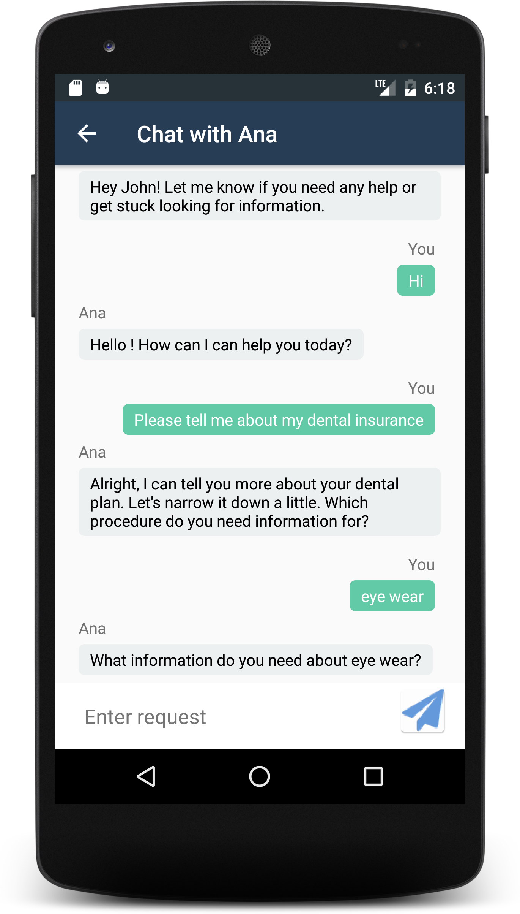

# Cloud Insurance Co. - Aplicação Android

[](https://travis-ci.org/IBM-Bluemix/insurance-bot-android)

Esse repositório é parte do projeto maior [Cloud Insurance Co.](https://github.com/IBM-Bluemix/cloudco-insurance).

# Visão Geral

Um app nativo de Android para interagir com o chatbot integrado no app [Cloud Insurance Co.](https://github.com/IBM-Bluemix/cloudco-insurance).

<p align="center">


</p>


## Requisitos da aplicação

* Android Studio 2.2.1 ou superior, Android 6.0 ou superior (API do android acima de 23)
* Gradle

## Rodando a aplicação no emulador de Android

1. O app depende do [App do Bot de Cloud Insurance](https://github.com/carlosbu/insurance-bot). Certifique-se de enviá-lo ao Bluemix primeiro. O caminho simples do envio é usar a [Toolchain de cloud insurance](https://github.com/carlosbu/insurance-toolchain).

1. Confira se o Gradle está devidamente configurado em seu ambiente.

1. Clone a aplicação para seu ambiente de trabalho pelo terminal de comandos usando o seguinte comando:

  ```
  git clone https://github.com/carlosbu/insurance-bot.git
  ```

* ou baixe e extraia o código fonte [deste arquivo](https://github.com/carlosbu/insurance-bot-android/archive/master.zip)

1. Abra o Android Studio e selecione "Open an existing Android Studio Project". Navegue para a pasta insurance-bot-android e Clique OK.

1. Edite `/app/src/main/res/values/config.xml` e substitua a propriedade `hosted_url` com o local no qual você publicou o app `insurance-bot`.

1. Permita a sincronização do Gradle Sync e sua compilação completar

1. Execute o app

## Licença

Veja o [arquivo de licença](License.txt) para informação sobre a licença.
